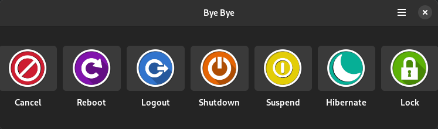

# Bye Bye
Bye-Bye is a GUI application which can be run through CLI(mainly in linux) to perform various system operation such as lock , cancel, shutdown, logout, reboot, hibernate etc.

## Note
I ported [this](https://gitlab.com/dwt1/byebye) application from Gtk Haskell to Gtk C based application.


# What I Learned

1. C programming language
2. GTk & GObject
3. Basics of Meson and Flatpak
4. How to write GUi using xml
5. How to port

# Screenshot



# How to build and Install application

### Using GNOME Builder.

 you can use [GNOME Builder](https://wiki.gnome.org/Apps/Builder) to builder project.
 
 step1: Clone repo into gnome builder.</br>
 step2: Press Run button.

### Using Meson

```bash
git clone https://github.com/GOTAM672/Bye-Bye.git
cd Bye-Bye
meson setup builddir
meson compile
sudo meson install
# To run application
./bye-bye
```

### Install using Meson into /usr/local path permanently

```bash
git clone https://github.com/GOTAM672/Bye-Bye.git
cd Bye-Bye
mkdir build
cd build
meson .. --buildtype=release --prefix=/usr/local -Dc_args=-O2 -Dcpp_args=-O2
ninja
sudo ninja install
# To run application 
bye-bye
```
